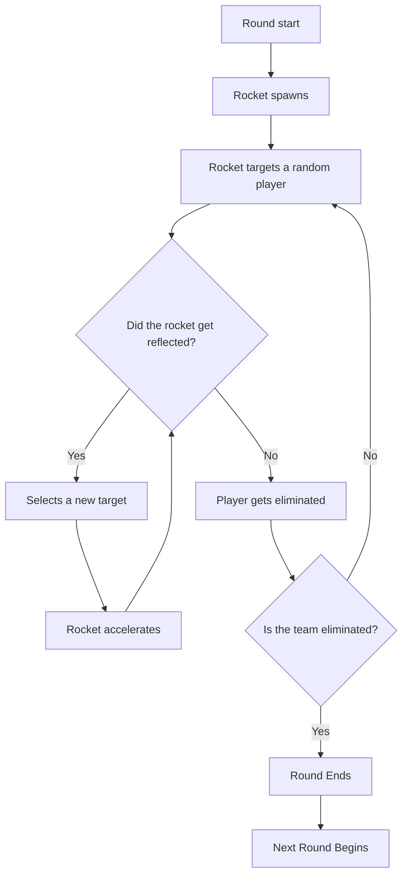

# Gameplay

## Match Structure

A typical Dodgeball match follows the structure shown below.

The goal is simple, **be the last team standing** by eliminating all opponents. A player is eliminated when they fail to deflect an incoming rocket.

---

## Game Modes

### Standard Dodgeball

The classic format with two opposing teams.

- Teams take turns reflecting rockets
- Elimination-based rounds

### Free For All (FFA)

As the name suggests every player is against everyone.

- Rockets can target anyone, even your teammates
- Last player standing wins

### NER (Never Ending Rounds)

Similar to **Standard Dodgeball**, here the difference is, when a team has no players left and there are more than 1 player alive in the other team, a random player is switched teams, this goes until one player stands at the end similar to [FFA](#Free-For-All-(FFA)).

---

## Maps

Dodgeball has a variety of community-made maps designed specifically for the game mode.
(These are prefixed with `tfdb_`)

//this tip is kinda useless imo
!!! info "Map Design"
    Good Dodgeball maps feature open sightlines, clear boundaries, no objects, and balanced spawn positions.

---

## Common Player Rules

| Rule            | Description                                 |
| --------------- | ------------------------------------------- |
| **No Stealing** | Don't reflect a rocket meant for a teammate |
| **No Delaying** | Don't intentionally prolong rounds          |
| **No Exploits** | Don't abuse map geometry or bugs            |

---

//this should be revised?
## Tips for New Players

!!! tip "Beginner Advice"
    
    1. **Watch the rocket** - Keep your crosshair on it at all times
    2. **Don't panic** - Calm reactions beat frantic button mashing
    3. **Learn timing** - Practice the airblast delay
    4. **Learn to orbit** - [Orbiting](../techniques/orbiting.md) helps you to time
    5. **Observe veterans** - Watch how experienced players move

---

## Next Steps

Now that you have an insight how dodgeball works, lets move to techniques. Start with [Airblasting](../techniques/airblasting.m).
