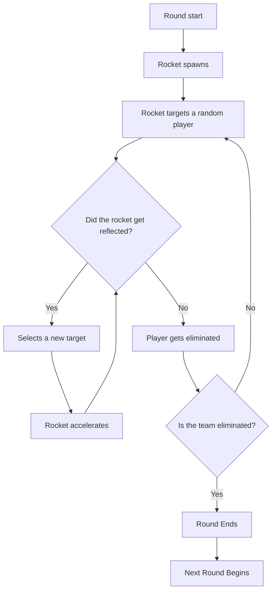

# Gameplay

## Match Structure

A typical Dodgeball match follows the structure shown below.

The goal is simple, **be the last team standing** by eliminating all opponents. A player is eliminated when they fail to deflect an incoming rocket.

## Common Server Rules

### Rocket Behavior

- **Starting Speed**: TBD (varies by server configuration)
- **Speed Increase**: Each reflect increases rocket speed
- **Maximum Speed**: TBD (server-dependent)
- **Turn Rate**: How sharply rockets can curve toward targets

### Player Rules

| Rule            | Description                                 |
| --------------- | ------------------------------------------- |
| **No Stealing** | Don't reflect a rocket meant for a teammate |
| **No Delaying** | Don't intentionally prolong rounds          |
| **No Exploits** | Don't abuse map geometry or bugs            |

---

## Game Modes

### Standard Dodgeball

The classic format with two opposing teams.

- Teams take turns reflecting rockets
- Elimination-based rounds
- Most common format

### Free For All (FFA)

Every player for themselves.

- Rockets can target anyone
- Last player standing wins
- Popular on casual servers

### NER (Never Ending Rounds)

Team based, but when there are two players left and lasting die everyone respawns to continue the round.

- Players switches team to keep round active if all players in one team dies

---

## Maps

Dodgeball has a variety of community-made maps designed specifically for the game mode.

All maps are prefixed `tfdb_` and there hundreds of various dodgeball maps to pick between.

!!! info "Map Design"
    Good Dodgeball maps feature open sightlines, clear boundaries, no objects, and balanced spawn positions.

---

## Tips for New Players

!!! tip "Beginner Advice"
    
    1. **Watch the rocket** - Keep your crosshair on it at all times
    2. **Don't panic** - Calm reactions beat frantic button mashing
    3. **Learn timing** - Practice the airblast delay
    4. **Learn to orbit** - [Orbiting](../techniques/orbiting.md) helps you to time
    5. **Observe veterans** - Watch how experienced players move

---

## Next Steps

Now that you understand the gameplay basics, it's time to learn the techniques that separate beginners from experts. Start with [Airblasting](../techniques/airblasting.md) to master the fundamental skill.
