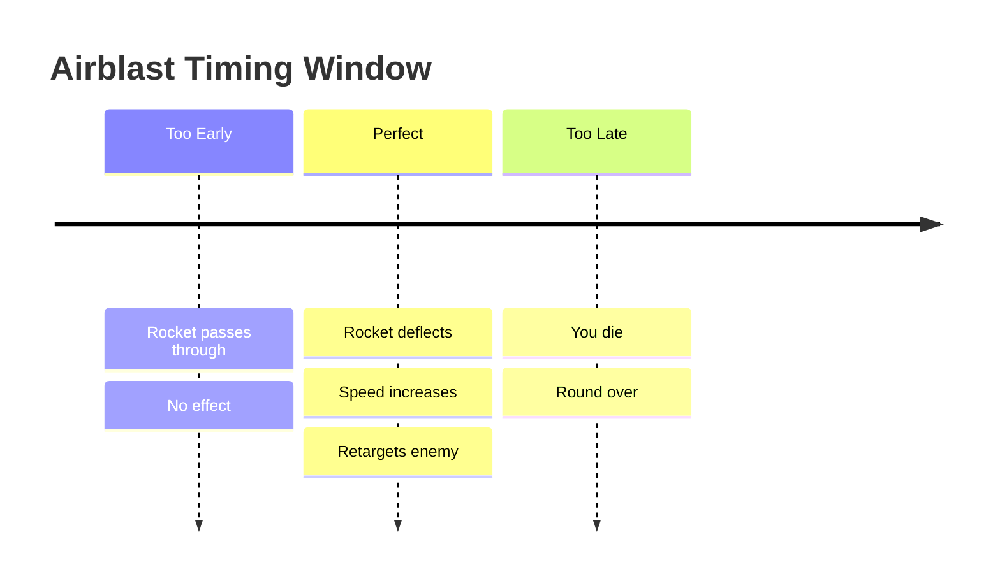

# Airblasting

**Difficulty**: :material-star

---

## Overview

**Airblasting** is the foundational skill of Dodgeball. Every other technique builds upon your ability to reliably reflect incoming rockets. Mastering the airblast means understanding its timing, range, and directional influence.

---

## The Basics

### How to Airblast

- **Button**: Right-click (Secondary Fire)
- **Effect**: Creates a blast of air that deflects projectiles
- **Cooldown**: 0.75 seconds cooldown default by TF2

---

## Timing

The most critical aspect of airblasting is **timing**. 

### The Timing Window

!!! TBD - Specific frame data and timing windows to be documented.

!!! warning "Common Mistake"
    New players often airblast too early. The rocket needs to be **within range** of your airblast cone before pressing the button.

---

## Direction Control

The direction of your reflected rocket is determined by your **crosshair position** at the moment of reflection.
For example if you keep your crosshair on the centre of your screen → Rocket goes straight forward, 
if you aim up, down → Rocket goes up and down
same goes for left and right.

Now you know how to manipulate the rocket's direction, this can also be dangerous because lets say a rocket is coming towards you, and if you keep your aim away from the rocket it might happen that your (cone shaped) airblast doesn't reflect the rocket. For beginners a good advice is to only move your crosshair from the center when you are sure where the rocket is coming from.

---
//idk whats this
## Positioning

!!! TBD - Good positioning gives you more reaction time and better control.

---
//meh
## Common Problems & Solutions

| Problem                | Cause          | Solution                                   |
| ---------------------- | -------------- | ------------------------------------------ |
| Missing easy rockets   | Timing off     | Focus on the rocket, not the enemy         |
| Random directions      | Looking around | Keep crosshair steady                      |
| Can't hit fast rockets | Panicking      | Stay calm, trust your timing, try to orbit |
| Inconsistent results   | No warmup      | Spend 5 minutes practicing first           |

---

## Advanced Considerations

Once you've mastered basic airblasting, you can begin learning advanced techniques:

- **[Orbiting](orbiting.md)**: Controlling rockets in circular patterns
- **[Dragging](dragging.md)**: Controlling which opponent the rocket targets
- **[Downspike](downspike.md)**: Sending rockets sharply downward
- **[Upspike](upspike.md)**: Launching rockets upward
- **[CQC](cqc.md)**: Close-range combat techniques
- **[Rally](rally.md)**: Rallying making the rocket live longer

---

## Next Steps

Comfortable with basic airblasting? Move on to [Orbiting](orbiting.md) to learn how to control who the rocket targets.
