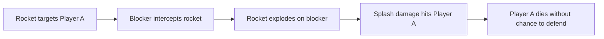

# Blocking

:material-star: **Difficulty**: Beginner | :material-alert: **Controversial**

---

## Overview

**Blocking** refers to physically obstructing an opponent's movement to disrupt their ability to airblast. By getting in a player's way, you can make it significantly harder for them to position themselves correctly to reflect an incoming rocket.

!!! warning "Competitive Rules"
    
    Blocking is **not allowed** in most competitive Dodgeball scenes. It is generally frowned upon in the community even in casual play. Check your server's rules before attempting.

---

## What is Blocking?

Blocking involves:

- **Body blocking**: Standing in an opponent's path
- **Movement disruption**: Getting in the way of their positioning
- **Timing interference**: Blocking at critical moments when they need to move

---

## Why Blocking is Frowned Upon

| Reason          | Explanation                                   |
| --------------- | --------------------------------------------- |
| Unsportsmanlike | Relies on physical interference, not skill    |
| Disrupts flow   | Breaks the reflect-based gameplay             |
| Frustrating     | Creates negative experience for opponents     |
| Rule violations | Banned in competitive and many casual servers |

---

## How Blocking Works

When a player is targeted by a rocket, they need to:

1. Move to position themselves
2. Aim at the incoming rocket
3. Time their airblast

Blocking disrupts step 1 - if they can't move freely, they may not be able to reach the optimal position to reflect.

### Common Blocking Situations

| Situation             | Effect                               |
| --------------------- | ------------------------------------ |
| Standing in doorway   | Blocks escape routes                 |
| Crowding teammate     | Interferes with their movement space |
| Pushing into opponent | Displaces their position             |

---

## Splash Damage Blocking

Another form of blocking involves intercepting rockets to cause splash damage:

When a rocket hits a blocker instead of its intended target, the resulting explosion can kill the actual target through splash damage. This denies the target any opportunity to defend themselves.

| Aspect          | Description                             |
| --------------- | --------------------------------------- |
| How it works    | Stand between rocket and target         |
| Result          | Target dies from splash, not direct hit |
| Why it's unfair | Target had no chance to airblast        |
| Penalty         | Usually kick/ban in competitive         |

---

## Rocket Body Blocking

Players can also destroy rockets by intentionally running into them:

| Action           | Effect                     |
| ---------------- | -------------------------- |
| Body into rocket | Rocket destroys on contact |
| Game impact      | Delays round, wastes time  |
| Common use       | Stalling, griefing         |

This form of blocking is used to delay the game by destroying rockets before they can be properly contested. It disrupts the flow of gameplay and is considered griefing on most servers.

!!! danger "Severe Penalty"
    
    Rocket body blocking (intentionally destroying rockets with your body) is typically treated as griefing and results in immediate kicks or bans on most servers.

---

## Server Rules

Different servers handle blocking differently:

| Server Type | Blocking Policy                         |
| ----------- | --------------------------------------- |
| Competitive | **Banned** - results in warnings/kicks  |
| Casual      | Usually discouraged, may result in kick |
| Some pubs   | Tolerated but frowned upon              |

!!! info "Check Rules First"
    
    Always check the server's rules. Most servers with active admins will warn or kick players who intentionally block.

---

## Related Techniques

- **[CQC](cqc.md)**: Close-range combat (skill-based, not blocking)
- **[Airblasting](airblasting.md)**: The core skill of the game

---

## Summary

While blocking *can* be effective at disrupting opponents, it goes against the spirit of Dodgeball which is about reflexes, aim, and airblast timing. Focus on improving your actual techniques rather than relying on physical interference.
