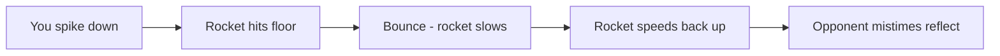

# Downspike

:material-star::material-star: **Difficulty**: Intermediate

---

## Overview

A **Downspike** is a technique where you send the rocket into the floor, causing it to bounce. The bounce temporarily slows the rocket before it returns to normal speed, disrupting your opponent's timing and making the reflect harder to predict.

---

## How It Works

When you spike a rocket downward, it hits the floor and bounces. This bounce causes the rocket to momentarily slow down, then accelerate back to its normal speed. This speed change throws off your opponent's timing.

The difficulty for your opponent:

| Phase       | What Happens             |
| ----------- | ------------------------ |
| Pre-bounce  | Rocket at normal speed   |
| On bounce   | Rocket slows momentarily |
| Post-bounce | Rocket accelerates again |
| Result      | Timing is harder to read |

---

## Execution Methods

There are two ways to perform a downspike:

### Method 1: Look Down

Simply aim your crosshair at the floor when you airblast.

| Step | Action                    |
| ---- | ------------------------- |
| 1    | Rocket approaches         |
| 2    | Aim crosshair at floor    |
| 3    | Airblast                  |
| 4    | Rocket spikes into ground |

### Method 2: Drag Down

Use [dragging](dragging.md) to pull the rocket's trajectory downward.

| Step | Action                        |
| ---- | ----------------------------- |
| 1    | Rocket approaches             |
| 2    | Aim down during drag window   |
| 3    | Rocket curves downward        |
| 4    | Rocket hits floor and bounces |

Both methods achieve the same effect - the rocket bounces off the floor with a speed change.

---

## Why Downspikes Are Effective

The speed change from bouncing is what makes downspikes difficult to handle:

**Timing Disruption:**

- Opponent expects consistent speed
- Bounce creates sudden slowdown
- Then rocket speeds back up
- Their airblast timing is thrown off

**Visual Confusion:**

- Rocket trajectory changes on bounce
- Harder to track than straight approach
- May approach from unexpected angle after bounce

---

## When to Use

| Good Situations                | Bad Situations             |
| ------------------------------ | -------------------------- |
| Breaking opponent's rhythm     | Low ceiling maps           |
| When opponent has good timing  | Very close range           |
| To reset neutral               | When you need direct hit   |
| Creating unpredictable rallies | Against elevated opponents |

---

## Defending Against Downspikes

If an opponent downspikes you:

| Counter                 | Description                            |
| ----------------------- | -------------------------------------- |
| Watch the bounce        | Time your reflect to post-bounce speed |
| Stay patient            | Don't airblast early during slowdown   |
| Position higher         | Reduces bounce effectiveness           |
| Anticipate speed change | Expect the slow-then-fast pattern      |

---

## Map Considerations

| Map Feature         | Effect                         |
| ------------------- | ------------------------------ |
| Flat floor          | Clean bounces, predictable     |
| Sloped surfaces     | Unpredictable bounce angles    |
| Props/obstacles     | May block or redirect bounce   |
| Distance from floor | More time for speed to recover |

---

## Practice Tips

!!! tip "Downspike Practice"
    
    1. Practice both look-down and drag-down methods
    2. Learn the timing of bounce slowdowns
    3. Observe how opponents struggle with speed changes
    4. Combine with other techniques for variety

---

## Related Techniques

- **[Upspike](upspike.md)**: The opposite vertical technique
- **[Airblasting](airblasting.md)**: Foundation skill
- **[Dragging](dragging.md)**: Alternative method to spike down
- **[CQC](cqc.md)**: Close-range spike opportunities

---

## Next Steps

Learn the counterpart technique: [Upspike](upspike.md) to master vertical rocket control.
