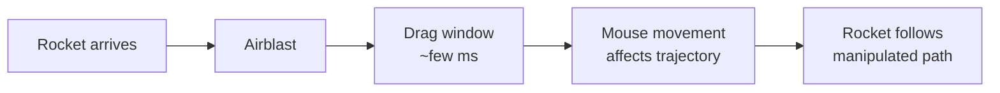

# Dragging

:material-star::material-star::material-star: **Difficulty**: Advanced

---

## Overview

**Dragging** is one of the hardest techniques in dodgeball. Within a few milliseconds, a player moves their mouse to align and manipulate the rocket's trajectory to their own advantage.

Every player can fine-tune their drag to perfection. It's a highly personal technique that takes significant practice to master.

---

## How Dragging Works

When you deflect, there's a brief window where your mouse movement influences where the rocket goes. By snapping or dragging your crosshair in a specific direction during this window, you manipulate the rocket's path.

---

## Why Dragging is Difficult

| Factor         | Challenge                         |
| -------------- | --------------------------------- |
| Timing window  | Extremely small (milliseconds)    |
| Precision      | Mouse movement must be exact      |
| Speed          | Must execute while rocket is fast |
| Consistency    | Repeating the same drag is hard   |
| Personal style | Everyone's drag feels different   |

!!! warning "Practice Required"
    Dragging cannot be learned quickly. It requires extensive practice to develop muscle memory and consistency.

---

## Drag Types

The following drag variations exist. Each one manipulates the rocket in a different way:

### Direct

*Details to be reviewed*

When a player drags the rocket to make it go in a straight line toward the target player.

---

### Bounce Direct

*Details to be reviewed*

The player first drags the rocket down, which makes it bounce off the floor. Then they snap it up to make it go direct. The result is a rocket that starts slow from the bounce, then shoots directly at the player.

---

### Side Directs

*Details to be reviewed*

A direct attack that comes from the sides rather than straight on.

---

### Up Direct

*Details to be reviewed*

A direct from above. Usually makes the rocket go a bit above the player's head, which often causes them to miss.

---

### Backfire

*Details to be reviewed*

An insanely quick drag that sends the rocket behind the player first. The rocket goes back a bit, then returns toward the target player. Very disorienting for the opponent.

---

## Developing Your Drag

**Personal Fine-Tuning:**

Every player develops their own drag style based on:

- Mouse sensitivity
- DPI settings
- Wrist vs arm aiming
- Personal timing feel
- Muscle memory patterns

What works for one player may not work for another.

---

## Practice Approach

!!! tip "Learning to Drag"
    
    1. Start with slow rockets to understand the feel
    2. Focus on one drag type at a time
    3. Develop consistency before adding speed
    4. Record and review your attempts
    5. Accept that mastery takes time

---

## Related Techniques

Dragging combines with other techniques:

- **[Downspike](downspike.md)**: Can be achieved via dragging down
- **[Upspike](upspike.md)**: Can be achieved via dragging up
- **[Orbiting](orbiting.md)**: Some drags work with orbital movement
- **[CQC](cqc.md)**: Fast drags essential at close range

---

## Summary

Dragging is about manipulating the rocket within a tiny time window using precise mouse movement. It's one of the most difficult techniques to master, but also one of the most rewarding. Each drag type creates a different rocket behavior, and each player develops their own personal style.
