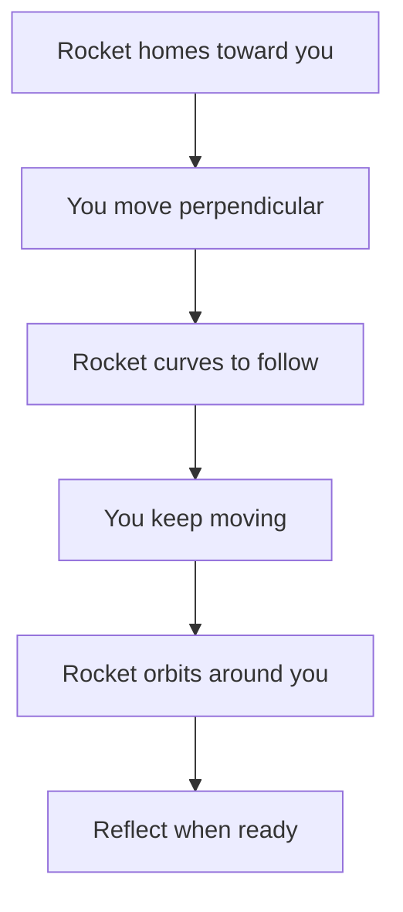
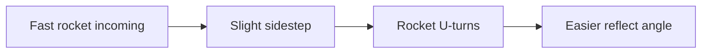
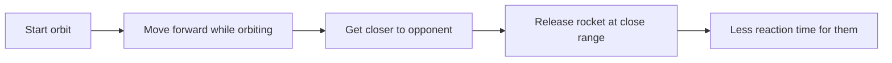

# Orbiting

:material-star::material-star: **Difficulty**: Intermediate

---

## Overview

**Orbiting** is a technique where you exploit the rocket's homing behavior to make it circle around you. Since the rocket constantly tracks and turns toward its target, you can use your movement to make it orbit rather than hitting you directly.

---

## What is Orbiting?

When a rocket is targeting you, it continuously adjusts its trajectory to follow you. By moving perpendicular to the rocket's path, you can make it curve around you in a circular pattern. The rocket's turn rate determines how tightly it can follow - and you can abuse this to delay your reflect timing.

---

## Why Orbiting Works

The homing rocket constantly tries to turn toward you, but it has a limited **turn rate**. By continuously moving to the side, you stay ahead of its tracking, causing it to circle:

| Factor            | Effect on Orbiting                |
| ----------------- | --------------------------------- |
| Low rocket speed  | Easier to orbit for longer        |
| High rocket speed | Harder to maintain orbit          |
| Low turn rate     | Wider orbits, easier to maintain  |
| High turn rate    | Tighter orbits, harder to control |

!!! info "Speed Scaling"
    
    Most TFDB plugins increase rocket speed with each deflection. This makes extended orbiting harder as the round progresses - the faster the rocket, the shorter your orbit window.

---

## Orbiting Methods

### Static Orbiting (WASD Pattern)

Stay relatively still and use WASD keys in a circular pattern to make the rocket orbit.

| Input Pattern | Movement                |
| ------------- | ----------------------- |
| W → D → S → A | Clockwise orbit         |
| W → A → S → D | Counter-clockwise orbit |

- Keep inputs smooth and consistent
- Time your pattern to the rocket's speed
- Works best with slower rockets

### Following Orbit (Strafe + Mouse)

Hold a strafe key and track the rocket with your mouse.

| Input         | Action                      |
| ------------- | --------------------------- |
| Hold D (or A) | Constant sideways movement  |
| Mouse         | Follow rocket visually      |
| Airblast      | When rocket completes orbit |

- More dynamic control
- Easier to react and adjust
- Good for varying rocket speeds

---

## Quick Orbit (U-Turn Technique)

For **fast rockets** where full orbits are impossible, you can do a "quick orbit":

1. Slightly move to the side as rocket approaches
2. Rocket's turn rate makes it curve sharply (U-turn)
3. Reflect the rocket as it comes back around

This is useful when:

- You're bad at timing direct reflects
- Rocket is too fast for proper orbit
- You need a safer angle to airblast

The U-turn creates a more predictable trajectory than a direct approach, giving you a slightly easier reflect.

---

## When to Orbit

**Good Situations:**

- Slow rockets (early in round)
- Need time to reposition
- Buying time for teammates
- Flexing on opponents

**Bad Situations:**

- High-speed rockets (late game)
- Cornered with no space
- Opponent pressuring aggressively
- Tight spaces

---

## Speed and Orbit Duration

| Rocket Speed     | Orbit Potential           |
| ---------------- | ------------------------- |
| Low (early game) | Multiple orbits possible  |
| Medium           | 1-2 orbits safely         |
| High (late game) | Quick orbit / U-turn only |
| Very high        | Direct reflect required   |

As deflections increase, speed increases. Extended orbiting becomes a liability - you'll need to reflect sooner or use the quick U-turn technique.

!!! warning "No Delaying Rules"
    
    Most Dodgeball servers have **no delaying** rules. Orbiting for too long can be considered delaying and may result in warnings or kicks. Keep your orbits brief and purposeful - don't orbit just to show off.

---

## Advanced Tactics

### Closing Distance

Skilled players can use orbiting to **close the gap** on opponents:

By moving toward your opponent during an orbit, you:

- Reduce their reaction time
- Create pressure and intimidation
- Set up for CQC situations

This is a mind game - opponents may panic when they see you approaching with an orbiting rocket.

| Tactic           | Effect                           |
| ---------------- | -------------------------------- |
| Orbit + approach | Psychological pressure           |
| Sudden release   | Catches opponent off-guard       |
| Fake approach    | Makes them retreat, opens angles |

---

## Common Mistakes

| Mistake           | Result                     | Fix                         |
| ----------------- | -------------------------- | --------------------------- |
| Moving too slow   | Rocket catches you         | Match speed to rocket       |
| Moving too fast   | Orbit becomes chaotic      | Smooth, consistent movement |
| Orbiting too long | Speed becomes unmanageable | Exit after 1-2 orbits       |
| Wrong direction   | Rocket hits you            | Always move perpendicular   |

---

## Practice Tips

!!! tip "Orbiting Practice"
    
    1. Start on servers with slow base rocket speed
    2. Practice static WASD orbiting first
    3. Then try strafe + mouse following
    4. Learn the quick U-turn for fast rockets
    5. Gradually practice on faster configs

---

## Related Techniques

- **[Airblasting](airblasting.md)**: The foundation of orbiting
- **[Dragging](dragging.md)**: Controlling target selection
- **[Switch](switch.md)**: Changing direction mid-orbit

---

## Next Steps

Once you're comfortable with orbiting, learn [Downspike](downspike.md) to add vertical attacks to your arsenal.
