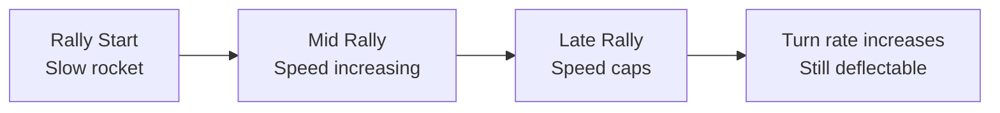

# Rally

:material-star::material-star: **Difficulty**: Intermediate

---

## Overview

A **Rally** is when two (or more) players decide to play a long game of reflecting back and forth, usually at longer distances. It's a test of dedication and focus - in theory, a rally can go on forever if both players want it to.

---

## What is a Rally?

The norm is a rally between two players who keep deflecting until one misses. The concept is simple: fight to stay alive the longest with the most deflections.

---

## Speed and Turn Rate Behavior

On most configs, the rocket doesn't get infinitely faster. At a certain speed, it caps and **turn rate increases instead**. This prevents rockets from becoming impossible to deflect.

| Rally Stage | Speed      | Turn Rate      | Deflectability |
| ----------- | ---------- | -------------- | -------------- |
| Early       | Slow       | Low            | Easy           |
| Mid         | Increasing | Low-Medium     | Normal         |
| Late        | Capped     | Increasing     | Harder angles  |
| Extended    | Max speed  | High turn rate | Still possible |

!!! info "Config Dependent"
    Different servers have different speed caps and turn rate increments. Rallies look very different across configs.

---

## Rally Variants

### Standard Rally

Two players at distance, reflecting back and forth. Pure endurance.

### Passing Rally

Players can [switch](switch.md) the rocket to another player, passing it around. This creates a unique multi-player rally where the rocket changes targets intentionally.

### Rally Steal

A rally can be **stolen mid-game** by another player. This is both a technique and a disruption.

When stolen:

- The timing changes for the original players
- The rocket may switch to a different target
- See [Stealing](stealing.md) for details

---

## Rally Distance

**Longer distance is typical for rallies:**

- More reaction time
- Cleaner deflections
- Less chaotic
- Tests pure skill

**Close range rallies are rare:**

- Much harder to sustain
- Quickly becomes [CQC](cqc.md)
- Higher chance of accidental techniques

---

## What Makes a Good Rally Player

| Quality      | Why It Matters                          |
| ------------ | --------------------------------------- |
| Focus        | Rallies require sustained concentration |
| Consistency  | One miss ends it                        |
| Patience     | Don't force unnecessary techniques      |
| Endurance    | Mental stamina over many deflections    |
| Adaptability | Handle speed and turn rate changes      |

---

## Rally Etiquette

In most servers, if two players are clearly rallying:

- Don't [steal](stealing.md) their rocket
- Let them finish their exchange
- Wait for the rally to end naturally

!!! warning "Stealing During Rallies"
    Stealing a rally rocket is usually frowned upon. Some servers punish it, others allow it. Know your server's rules.

---

## Ending a Rally

A rally ends when:

| Ending  | Description                          |
| ------- | ------------------------------------ |
| Miss    | Someone fails to deflect             |
| Kill    | Someone lands a killing technique    |
| Steal   | Another player takes the rocket      |
| Pass    | Intentional switch to another player |
| Timeout | Some servers have rocket timeouts    |

---

## Rally Strategy

### When to Keep Rallying

| Situation                           | Reason              |
| ----------------------------------- | ------------------- |
| You're comfortable at current speed | Keep going          |
| Opponent seems stressed             | Pressure builds     |
| Testing their limits                | See when they crack |
| You enjoy long rallies              | It's a playstyle    |

### When to End It

| Situation                    | Reason                  |
| ---------------------------- | ----------------------- |
| Good angle opportunity       | Take the kill           |
| Approaching your speed limit | End before you fail     |
| Getting bored                | Nothing wrong with that |
| Opponent is too comfortable  | Change the dynamic      |

---

## Config Effects on Rallies

| Config Setting      | Effect on Rally              |
| ------------------- | ---------------------------- |
| Speed cap           | How fast rockets max out     |
| Speed increment     | How quickly speed increases  |
| Turn rate increment | How turn rate changes at cap |
| Max turn rate       | Upper limit on turn rate     |

Different configs create different rally experiences:

- **Low speed cap**: Rallies stay manageable longer
- **High speed cap**: Extreme speeds reached
- **High turn rate increment**: Angles get wild at extended rallies

---

## Practice Tips

!!! tip "Rally Training"
    
    1. Find a rally partner at similar skill level
    2. Practice sustaining long deflection chains
    3. Learn your comfortable speed threshold
    4. Practice intentional rally breaks (killing techniques)
    5. Work on focus and concentration over time

---

## Related Techniques

- **[Switch](switch.md)**: Passing to other players during rally
- **[Stealing](stealing.md)**: Taking a rally rocket
- **[Sniping](sniping.md)**: Targeting unexpected players

---

## Common Rally Mistakes

| Mistake        | Problem              | Fix                     |
| -------------- | -------------------- | ----------------------- |
| Rushing        | Miss reflects        | Patience pays           |
| Going passive  | Become predictable   | Stay active             |
| Ignoring speed | Get overwhelmed      | Plan for speed increase |
| Overcommitting | Miss when it matters | Save aggression         |

---

## Related Techniques

- **[Airblasting](airblasting.md)**: Foundation for all rally play
- **[Dragging](dragging.md)**: Target manipulation during rallies
- **[Switch](switch.md)**: Breaking rally patterns

---

## Next Steps

Learn [Switch](switch.md) techniques to break patterns and surprise opponents.
