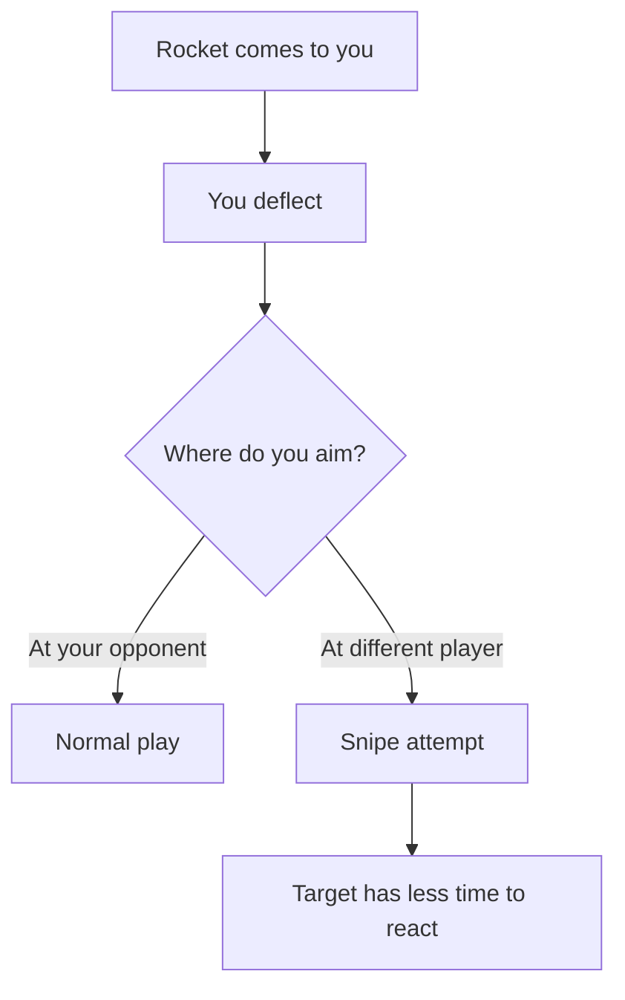
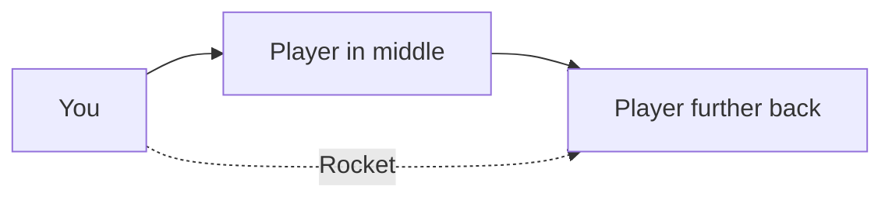

# Sniping

:material-star::material-star: **Difficulty**: Intermediate

---

## Overview

**Sniping** is when you target a player who wasn't expecting the rocket. Instead of deflecting back to the player you're engaged with, you redirect it to hit someone else entirely.

---

## How Sniping Works

The sniped player often has poor positioning or isn't paying attention to you.

---

## SelectTarget Abuse

The homing system uses **SelectTarget** logic to choose who the rocket will chase. This can be exploited:

| Scenario                     | What Happens                   |
| ---------------------------- | ------------------------------ |
| Player A is closest          | Normally targeted              |
| Player B is slightly further | May be favored by SelectTarget |
| Player C is in the middle    | Might not be targeted at all   |

!!! info "Target Selection Logic"
    The SelectTarget system doesn't always pick the closest player. It can favor players further away, allowing you to snipe past someone in the middle.

---

## The Middle Player Problem

A common snipe scenario:

The rocket may skip the middle player and target the one behind them because of how SelectTarget prioritizes targets.

---

## Executing a Snipe

| Step | Action                          |
| ---- | ------------------------------- |
| 1    | Identify a vulnerable target    |
| 2    | Aim toward them when deflecting |
| 3    | Let SelectTarget do its work    |
| 4    | Watch for the kill              |

The key is understanding that you're not directly controlling the target - you're influencing where the rocket goes and letting the homing system pick up a different player.

---

## Snipe Targets

**Good snipe targets:**

- Players not watching you
- Players out of position
- Players behind other players (SelectTarget abuse)
- Players who just spawned

**Poor snipe targets:**

- Alert players watching the rocket
- Players in defensive positions
- Players who expect snipes

---

## Defending Against Snipes

| Defense                                      | Why It Works                  |
| -------------------------------------------- | ----------------------------- |
| Stay aware of all rockets                    | Not just "your" rocket        |
| Position well                                | Don't be an easy snipe target |
| Watch other players                          | See what they're aiming at    |
| Be ready to [steal](stealing.md) defensively | Save yourself if sniped       |

!!! warning "Positioning Matters"
    If you position yourself poorly and get sniped, it's generally your fault. [Stealing](stealing.md) to save yourself in this case may not be allowed.

---

## Snipe vs Switch

| Technique               | Description                                |
| ----------------------- | ------------------------------------------ |
| **Snipe**               | Exploit targeting to hit unexpected player |
| **[Switch](switch.md)** | Intentionally change target during deflect |

A switch is a deliberate technique. A snipe is exploiting the targeting system.

---

## When Sniping is Effective

| Situation   | Effectiveness      |
| ----------- | ------------------ |
| FFA servers | High - chaos helps |
| Team modes  | Depends on rules   |
| 1v1         | Not applicable     |
| Competitive | Often discouraged  |

---

## Server Rules

Different servers have different attitudes toward sniping:

| Server Type | Typical Rule     |
| ----------- | ---------------- |
| Casual FFA  | Usually allowed  |
| Competitive | Often restricted |
| Team modes  | May be punished  |

---

## Ethics of Sniping

**Arguments For:**

- Part of the game mechanics
- Rewards awareness
- Creates dynamic gameplay

**Arguments Against:**

- Feels unfair to the target
- Exploits targeting quirks
- Disrupts intended gameplay

Know your server's culture.

---

## Related Techniques

- **[Stealing](stealing.md)**: Taking rockets not meant for you
- **[Switch](switch.md)**: Intentional target changes
- **[Rally](rally.md)**: Can be disrupted by snipes

---

## Summary

Sniping exploits the SelectTarget system to hit players who weren't expecting the rocket. It's particularly effective when players position themselves behind others, where the targeting logic may skip the closer player. Whether it's considered fair play depends on the server and community.
