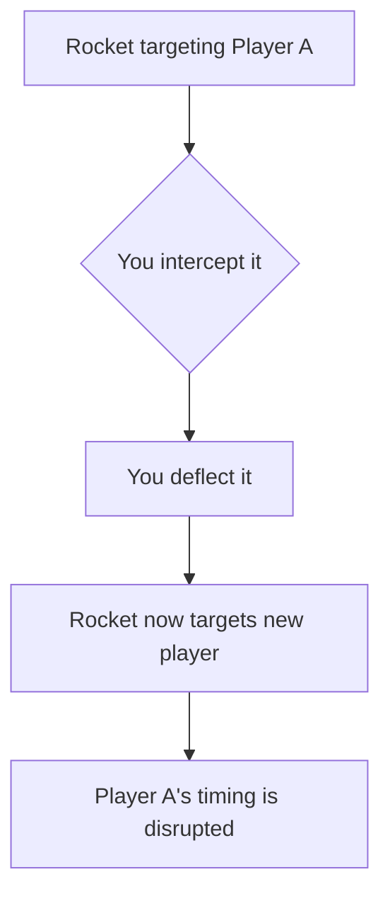

# Stealing

:material-star: **Difficulty**: Basic (execution) / **Controversial** (etiquette)

---

## Overview

**Stealing** is taking a rocket that wasn't meant for you. The rocket is only "yours" when you hear the sentry beep sound indicating you are the target. Taking someone else's rocket is a steal.

---

## How Stealing Works

When you steal:

- The original target loses their expected timing
- The rocket switches to a new target
- You've interrupted someone else's gameplay

---

## When is a Rocket "Yours"?

| Indicator            | Meaning                         |
| -------------------- | ------------------------------- |
| Sentry beep heard    | You are the target - it's yours |
| No beep              | Not your rocket                 |
| Beep on someone else | Their rocket                    |

!!! info "The Sentry Beep"
    The targeting sound (sentry beep) tells you when you're the target. If you don't hear it, the rocket isn't meant for you.

---

## Stealing Rules

**Usually NOT Allowed:**

- Stealing during [rallies](rally.md)
- Stealing to disrupt other players
- Habitual stealing

**Consequences:**

- Some servers slay you after X steals
- Some servers have no punishment
- Community will judge you regardless

---

## Defensive Stealing

There's one scenario where stealing is often tolerated:

### Saving Yourself from a Snipe

If you're about to be hit by a rocket that was [sniped](sniping.md) at you (targeted at you unexpectedly), you may steal/deflect to save yourself.

| Situation                                 | Usually Allowed? |
| ----------------------------------------- | ---------------- |
| You got sniped, deflect to survive        | Yes              |
| You walked into rocket's path, then steal | No               |
| You positioned badly, then steal to save  | Usually no       |

!!! warning "Positioning Matters"
    If you put yourself in a position where you could be sniped, stealing to save yourself is often **not allowed**. You're responsible for your positioning.

---

## Why Stealing is Discouraged

| Reason            | Explanation                              |
| ----------------- | ---------------------------------------- |
| Disrupts gameplay | Breaks the flow between players          |
| Unfair advantage  | You weren't supposed to have that rocket |
| Timing disruption | Original target loses their rhythm       |
| Community norms   | Generally considered bad etiquette       |

---

## Steal vs Accidental Intercept

Sometimes you accidentally intercept a rocket:

| Scenario                        | Is It a Steal?            |
| ------------------------------- | ------------------------- |
| You airblasted at wrong time    | Accidental, still a steal |
| Rocket passed through you       | Depends on intent         |
| You were moving and intercepted | Usually accidental        |
| You deliberately took it        | Intentional steal         |

Accidents happen, but repeated "accidents" are noticed.

---

## Server Enforcement

Different servers handle stealing differently:

| Server Type | Typical Rule            |
| ----------- | ----------------------- |
| Strict      | Slay after 2-3 steals   |
| Moderate    | Warning then slay       |
| Lenient     | No automatic punishment |
| Competitive | Usually strict rules    |

---

## Strategic Stealing (Where Allowed)

On servers that allow stealing, it can be used strategically:

- Interrupt a [rally](rally.md) you're not part of
- Take rockets from players you want to target
- Create chaos

!!! danger "Know Your Server"
    Only do this on servers where it's explicitly allowed. Most servers discourage or punish stealing.

---

## Avoiding Being Stolen From

| Tip                            | Effect                       |
| ------------------------------ | ---------------------------- |
| Keep distance from others      | Less chance of intercept     |
| Stay aware of player positions | Know who might steal         |
| Learn server rules             | Know if stealing is punished |

---

## Related Techniques

- **[Rally](rally.md)**: Often disrupted by stealing
- **[Sniping](sniping.md)**: Related targeting behavior
- **[Switch](switch.md)**: Intentional target change (not stealing)

---

## Summary

Stealing is taking a rocket not meant for you. While mechanically simple, it's usually discouraged or punished. The only commonly accepted exception is deflecting to save yourself from an incoming snipe - but even then, if you positioned yourself poorly, it's often not allowed.
