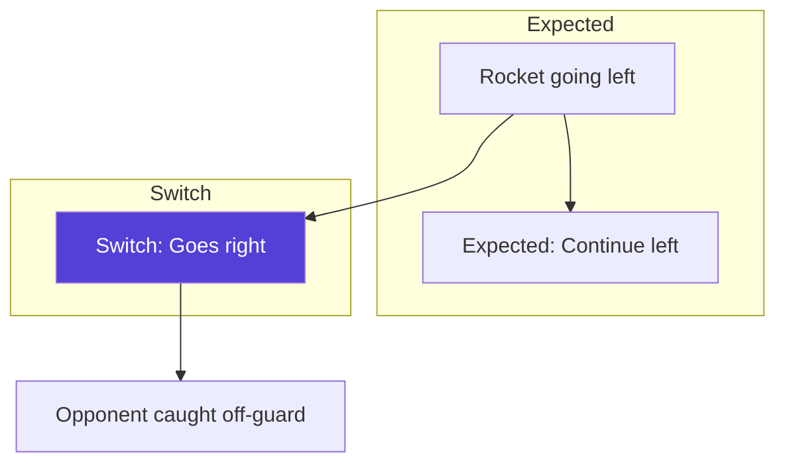

# Switch

:material-star::material-star::material-star: **Difficulty**: Advanced

---

## Overview

A **Switch** is the technique of dramatically changing a rocket's direction mid-rally. Unlike subtle angle adjustments, a switch sends the rocket in a significantly different direction than expected, catching opponents off-guard.

---

## What is a Switch?

When you've established a predictable pattern of rocket trajectory, a switch breaks that pattern with an unexpected directional change:

---

## Types of Switches

### Direction Switch

Changing the horizontal direction of the rocket.

| From    | To       | Effectiveness |
| ------- | -------- | ------------- |
| Left    | Right    | High          |
| Forward | Angled   | Medium        |
| Angled  | Straight | Medium        |

### Vertical Switch

Changing from horizontal to vertical trajectory or vice versa.

| From  | To        | Effectiveness |
| ----- | --------- | ------------- |
| Flat  | Upspike   | High          |
| Flat  | Downspike | Very High     |
| Spike | Flat      | Medium        |

### Speed Switch

TBD - Techniques affecting rocket speed perception.

---

## Execution

### Basic Switch

1. **Establish pattern**: Make 2-3 reflects in one direction
2. **Read opponent**: See them adjusting to your pattern
3. **Execute switch**: Sharp angle to opposite direction
4. **Commit**: Full confidence in the new direction

### Timing the Switch

| Pattern Length | Switch Effectiveness          |
| -------------- | ----------------------------- |
| 1 reflect      | Low (no pattern established)  |
| 2-3 reflects   | Optimal                       |
| 4+ reflects    | Diminishing (opponent adapts) |

---

## When to Switch

**Good Timing:**

- Opponent has committed to covering one angle
- You see them moving in a predictable direction
- Rally has established a clear pattern
- You have room to execute

**Bad Timing:**

- Rocket is too fast to control
- No pattern has been established
- Opponent is centrally positioned
- You're in a compromised position

---

## Reading the Switch Opportunity

Signs your opponent is vulnerable:

| Sign                   | What It Means                  |
| ---------------------- | ------------------------------ |
| Movement to one side   | Covering that angle only       |
| Consistent crosshair   | Expecting same trajectory      |
| Settling into position | Committed to current read      |
| Pattern recognition    | They think they know your plan |

---

## Defending Against Switches

!!! warning "Expecting the Switch"
    
    Good players will switch. Counter by:
    
    - **Stay central**: Don't over-commit to angles
    - **Watch the player**: Not just the rocket
    - **Expect change**: After 2-3 predictions, be ready
    - **Quick adjustments**: Keep mobile

---

## Switch Combinations

### Orbit Switch

Starting an [orbit](orbiting.md) then switching direction.

- High difficulty
- Very deceptive
- TBD - Execution details

### Spike Switch

Combining [spikes](downspike.md) with direction changes.

- Up to down or vice versa
- Extreme confusion
- TBD - Execution details

---

## Practice Routine

!!! tip "Switch Training"
    
    1. Practice deliberate pattern establishment
    2. Work on sharp angle changes
    3. Learn to read opponent positioning
    4. Time your switches for maximum effect
    5. Combine with other techniques

---

## Common Switch Errors

| Error                | Result             | Fix                   |
| -------------------- | ------------------ | --------------------- |
| No pattern first     | Switch expected    | Build pattern first   |
| Weak angle           | Obvious change     | Commit to sharp angle |
| Bad timing           | Wasted opportunity | Read opponent better  |
| Predictable switches | Counter-read       | Vary switch timing    |

---

## Advanced Concepts

### Double Switch

TBD - Switching the switch.

### Fake Switch

TBD - Baiting opponent then not switching.

### Switch Under Pressure

TBD - Executing switches at high speed.

---

## Related Techniques

- **[Dragging](dragging.md)**: Target manipulation
- **[Orbiting](orbiting.md)**: Curved trajectory control
- **[Rally](rally.md)**: Extended exchanges

---

## Next Steps

Explore [CQC](cqc.md) for close-range combat situations.
