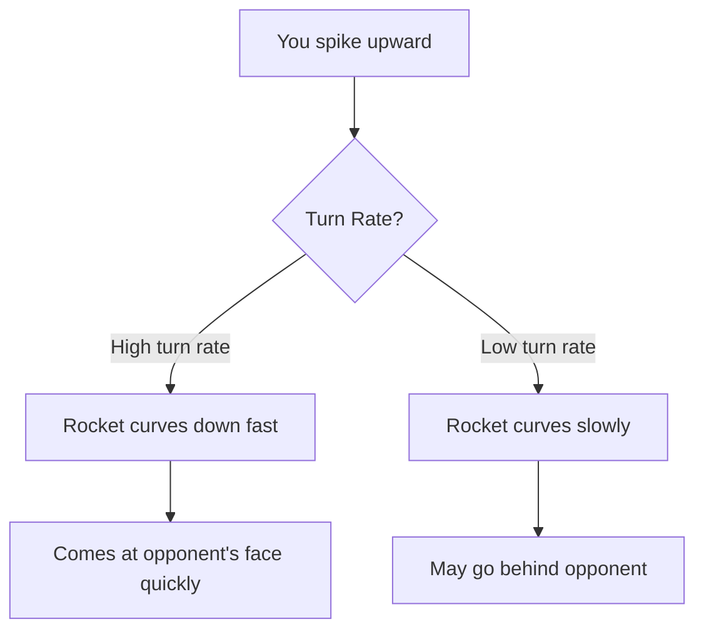

# Upspike

:material-star::material-star: **Difficulty**: Intermediate

---

## Overview

An **Upspike** sends the rocket upward, either by looking up or dragging it up. Unlike downspikes, the outcome of an upspike is **highly dependent on the server's configuration** - specifically the rocket's turn rate and current speed.

---

## How It Works

When you spike a rocket upward, what happens next depends entirely on the rocket's turn rate and speed:

---

## Turn Rate Effects

The turn rate determines how quickly the rocket can curve back toward its target:

| Turn Rate | Behavior                                    | Difficulty for Opponent       |
| --------- | ------------------------------------------- | ----------------------------- |
| Very High | Rocket goes up, then sharply down into face | Hard - fast and unpredictable |
| High      | Rocket arcs and comes down quickly          | Moderate                      |
| Medium    | Standard arc, predictable curve             | Normal                        |
| Low       | Rocket may overshoot and go behind          | Can be easier or confusing    |
| Very Low  | Rocket goes way behind opponent             | May miss entirely             |

---

## Speed Effects

Speed also changes the upspike behavior:

| Speed       | Effect                                         |
| ----------- | ---------------------------------------------- |
| Slow rocket | More time to curve, tighter arc possible       |
| Fast rocket | Less time to curve, wider arc                  |
| Very fast   | May barely curve at all before reaching target |

The combination of speed and turn rate creates vastly different outcomes.

---

## Execution Methods

### Method 1: Look Up

Aim your crosshair upward when you airblast.

### Method 2: Drag Up

Use [dragging](dragging.md) to pull the rocket's trajectory upward during the drag window.

Both methods achieve the same effect - the rocket goes upward initially.

---

## Config Dependency

!!! warning "Server Configuration Matters"
    
    Upspike effectiveness varies dramatically between servers. What works on one config may not work on another. Learn how your server's rockets behave before relying on upspikes.

| Config Setting        | Impact on Upspike                     |
| --------------------- | ------------------------------------- |
| `turn rate`           | How sharply rocket curves back        |
| `turn rate increment` | How this changes per deflection       |
| `speed`               | How far rocket travels before curving |
| `speed increment`     | Speed gets faster each deflect        |

---

## When Upspikes Work Best

**High Turn Rate Servers:**

- Rocket comes down fast into opponent's face
- Hard to predict exact angle
- Good for aggressive play

**Low Turn Rate Servers:**

- Rocket may go behind opponent
- Can create confusion
- May miss if opponent doesn't move

---

## Position and Distance

Your position relative to opponent also affects outcomes:

| Situation         | Effect                                  |
| ----------------- | --------------------------------------- |
| Close range       | Rocket may go over and behind them      |
| Medium range      | Standard upspike behavior               |
| Long range        | More time for rocket to curve properly  |
| You're below them | Rocket approaches from below, curves up |
| You're above them | Different arc dynamics                  |

---

## Ceiling Interactions

!!! warning "Watch the Ceiling"
    On maps with low ceilings, upspikes can bounce off the ceiling, creating unpredictable results.

---

## Defending Against Upspikes

| Scenario       | Counter                              |
| -------------- | ------------------------------------ |
| High turn rate | Look up quickly, expect fast descent |
| Low turn rate  | Check behind you                     |
| Fast rocket    | Less time to react                   |
| Slow rocket    | Track the arc carefully              |

---

## Upspike vs Downspike

| Aspect           | Upspike                       | Downspike                     |
| ---------------- | ----------------------------- | ----------------------------- |
| Config dependent | **Very** - turn rate critical | Less - bounces are consistent |
| Predictability   | Varies by config              | More consistent               |
| Speed change     | No bounce, maintains speed    | Bounce slows then speeds up   |
| Risk             | May miss on low turn rate     | Usually hits floor            |

---

## Practice Tips

!!! tip "Upspike Practice"
    
    1. Learn your server's turn rate behavior first
    2. Test upspikes at different speeds (early vs late round)
    3. Notice how turn rate increment changes behavior over time
    4. Practice both look-up and drag-up methods
    5. Understand that this technique is config-specific

---

## Related Techniques

- **[Downspike](downspike.md)**: Opposite vertical technique
- **[Orbiting](orbiting.md)**: Combines well with upspikes
- **[Dragging](dragging.md)**: Alternative method to spike up

---

## Next Steps

Ready for close-range action? Learn [CQC (Close Quarter Combat)](cqc.md) techniques.
